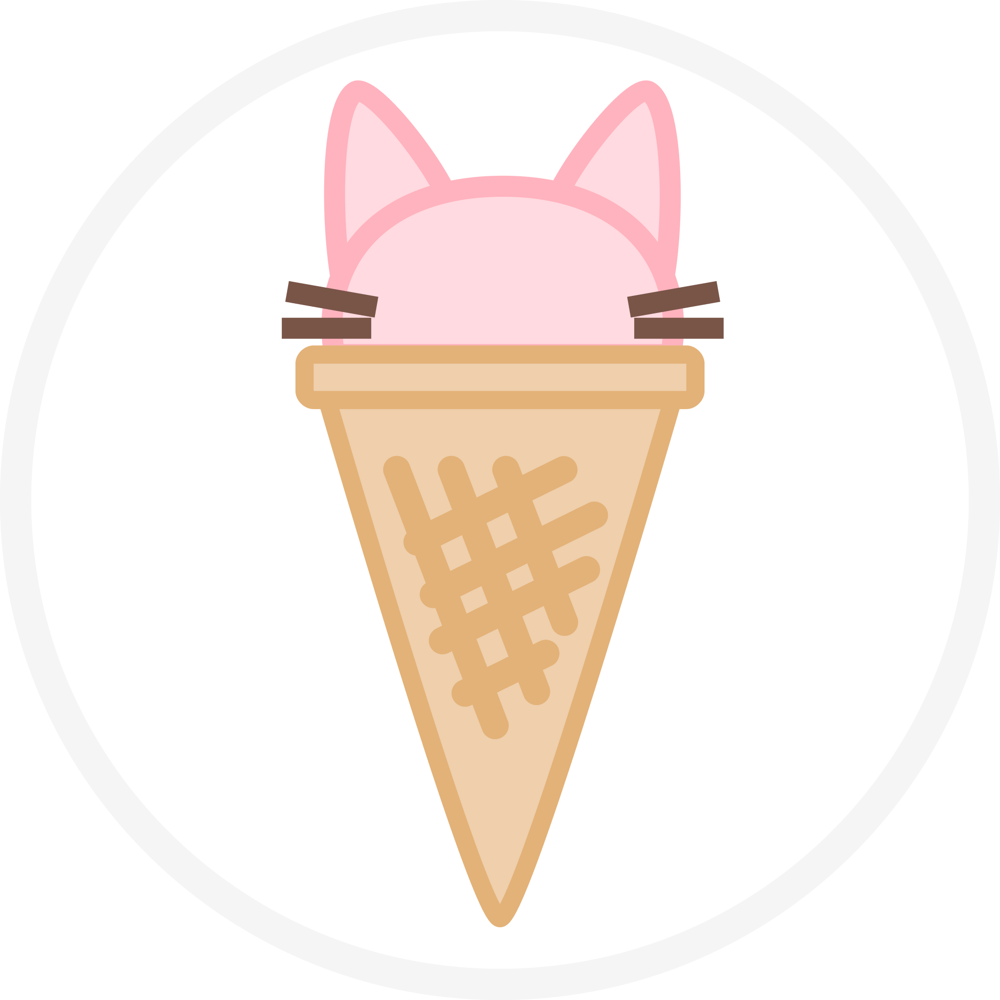
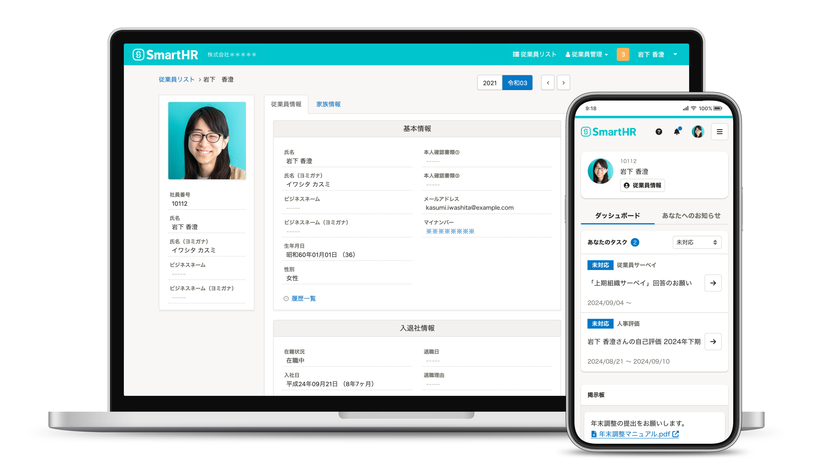

# アクセシビリティ課題チケットは なぜ積まれ続けるのか？

SmartHR アクセシビリティエンジニア たじまん

アクセシビリティ対応の「どこまでやる？」を言語化する 
　~チームで迷わないための設計と判断基準~ 
@2026/04/10

---
hide: true
---

## 目次

1. 環境紹介（1分）
    - アクセシビリティ専門組織でアクセシビリティエンジニアをやっています
    - SmartHRの紹介
    - 基準やドキュメント
        - 品質基準と簡易チェックリストがあります
        - 開発方針があります
    - 実装ベース
        - コンポーネントライブラリ
        - eslintカスタムルール
    - これらによって、新しく生まれるプロダクトや機能は、ほとんどアクセシビリティのNGがない状態で生まれます
    - しかしながら一方で、古いプロダクトを中心にまだa11y課題自体は多く残っています。またアクセシビリティテスターが報告するissueチケットも爆速で改善されるということはなく、後回しにされがちです。
1. 問い → 原因（2分）
    - a11y不具合をa11y部が直すのも一手ですが、a11y部の願いは、PdEのみでもアクセシブルなプロダクトを生み出す開発組織を作り出し、AEという職は不要になる世界です。
    - そこで a11yチケットがなぜ後回しにされがちなのか調査し、改善策を探りました。
    - わかったこととして、PdEの第一のタスクはOKRの達成であり、OKRにはPOやPMが定めた機能提供が占めていること
    - それ以外にも昨今のエンジニアは、アクセシビリティ以外にもセキュリティやパフォーマンス、AIのキャッチアップなどやるべきことが沢山あり、忙しい
    <!-- - SmartHRでは、先んじて uxw と qae がPdEへの専門知識のイネイブリングとその撤退判断をした過去もありました -->
    - そのため、心理的にアクセシビリティ課題の改善に使う絶対的な理由がない限りハードルが高くなってしまっている
    <!-- - 最近、アクセシビリティスペシャリストによる全体的な調査では、自覚的なスキルの無さと、アクセシビリティに取り組むハードルの高さに相関があることもわかりました（Joonasさんに許可をとって流れ的に大丈夫そうならいれる） -->
2. 対策案（5分）
    - そこで、アクセシビリティ改善をとりくむきっかけがあれば変わるのではないか？という仮説のもと、きっかけとなる場を用意することにしました。
    1. アクセシビリティ大臣を置く
        - 各チームにチケットの窓口担当を設ける
        - 専門知識不要・チームとアクセシビリティ部の橋渡し役
    2. 月1リファインメントで事前にセットアップする
        - 何を直すか・どう直すか・誰がやるかを一緒に決めておく
        - 育成も兼ねる
        - PdEとともに考えるフェーズを行うことで、あとは「手を動かす」だけの状態にする
    - 現状共有：アクセシビリティ改善をやるきっかけを用意し、やりやすい状況をつくる
        - アクセシビリティ部にとってはPdEが自ら改善するサイクルを作れてハッピー（持続可能的）
        - やりたくてもできなかったひと、月に数時間程度なら負担も大きすぎず改善ができる
        - また、改善方針を決めて後はやるだけ状態にすることで、AIを使った自動修正による改善も行えるようになる
            - a11y部ではなくPdEによって改善したというのが良いのだ
        - なお、リファは永続的な仕組みではなく、ゆくゆくはPdEが自立してうごけるようなサポート的な立場を探っていきます
3. 持ち帰り（2分）
    - 原理：PdEがチケットを後回しにするのは、やりたくないのではなく今はできないなのかもしれない
    - 明日できること
        - エンジニアができない原因を探るのも大事
        - 一番大事なのはコミュニケーション

---
layout: two-cols
---

## 自己紹介

- SmartHRのアクセシビリティ専門ユニットでアクセシビリティエンジニアをしています
- 2024年8月〜
- 前職はフロントエンドエンジニア

::right::

<figure>
  
  <figcaption>たじまんのインターネット上のすがた</figcaption>
</figure>

---
layout: two-cols-header
---

## 会社紹介

::left::

SmartHRは 
「well-working 労働にまつわる社会課題をなくし、誰もがその人らしく働ける社会を作る。」 
というミッションを掲げ、働くすべての人を後押しする人事・労務プロダクトをつくっています。
<!-- タレマネは！？ -->

::right::

---
transition: slide-up
layout: two-cols-header
---

## SmartHRとアクセシビリティの紹介

<!-- 時間がありそうだったら広げる -->

::left::

### 文章ベース

- デザインシステムにて [Accessibilityページ](https://smarthr.design/accessibility/) を作成
- [品質基準](https://smarthr.design/products/usability/accessibility/) や [アクセシビリティに関する開発方針](https://smarthr.design/accessibility/#h2-1) などの基準を定める
- 品質基準を達成しているか簡易的に試験できる [簡易チェックリスト](https://smarthr.design/accessibility/check-list/) を公開

::right::

### 実装ベース

- アクセシブルなコンポーネントライブラリ[SmartHR UI](https://smarthr.design/products/components/)を提供
- カスタムeslintルール eslint-plugin-smarthr を提供し、SmartHRプロダクトに最適化しています ( [詳しく知る](https://tech.smarthr.jp/entry/2024/03/19/150235) )。
- 現在、Agent Skills, デザインシステムのMCPサーバーなど計画中

---
layout: center
---

これらによって、新しく生まれるプロダクトや機能は、ほぼアクセシビリティ課題がない状態でリリースすることができています。

<v-click>
しかしながら、その後のアクセシビリティ試験で見つかる課題チケットの改善自体は後回しにされがちです。
そのため、古いプロダクトを中心にアクセシビリティ課題自体は多く積まれています。
</v-click>

---

## アクセシビリティ課題の解決方針

溜まったチケットを a11y 部が改善するという手段もあるが、 
「アクセシビリティエンジニアという職が不要となる未来」のために、 
できる限りプロダクトエンジニアが直すサイクルを作り、a11y部による解決は最終手段としたい。

<!-- TODO:最初からunderline引きたい -->

そこで、何が課題解決のボトルネックとなっているか調査しました

---

## プロダクトエンジニアのコスト配分

- まず、プロダクトエンジニアのミッションは新機能をユーザーに提供すること
- 新機能の提供タスク以外の、その他改善に使えるのは20%程度
- 昨今のエンジニアには、AI技術のキャッチアップを初め、セキュリティ要件やパフォーマンス改善などアクセシビリティ以外にも優先事項が大量にある

優先度が高い課題が並ぶ中、アクセシビリティへの意識が向きづらいだけなのかも知れないと仮定

---
layout: center
---

そこで、アクセシビリティ改善を取り組むきっかけがあれば、状況が変わるのではないか？という仮説のもと、きっかけとなる場を用意することにしました

---

## アクセシビリティを取り組む「きっかけ」

<!-- 取り組む理由という単語を聞くと、会社としてや開発組織としての理由を想像しそう -->
<!-- 取り組む理由をむしろひとが考えて良くなったみたいなかんじなので、きっかけのほうがよさそう -->

<v-clicks>

1. 各チームにアクセシビリティ課題チケットを受け取る窓口担当を置く
2. アクセシビリティ課題チケットのリファインメントを実施する

</v-clicks>

---

## 1. 各チームにa11y課題チケットを受け取る窓口担当を置く

- 各開発チームに1人アクセシビリティ課題チケットを受け取る人を置きます
- 担当者となるハードルを下げるため
    - アクセシビリティに詳しくなくても良い（あくまで窓口）
    - 開発チームの別メンバーと交代しても良い

定期的にアクセシビリティ課題チケットを受け取る作業が発生することで、課題解決する「きっかけ」を作りだす狙い

---

## 2. a11y課題チケットのリファインメントを実施する

- チケットが溜まったら月1程度で、アクセシビリティエンジニアから、a11y課題チケットのリファインメント実施の提案する
- リファインメントで修正方針や完了の条件をすりあわせ、「あとはやるだけ」にすることで実行ハードルを下げる

アクセシビリティやっていきの人には、改善するきっかけを用意する 
スキルに自信がない人には、解説やサポートを提供する

---
layout: center
---

### <mdi-star /> ポイント

なおリファインメントは永続的な仕組みではなく、一次的な施策という位置づけです。

ゆくゆくはプロダクトエンジニアが自立してアクセシビリティ改善を動けるように、サポート的な立場を探っていきます。
---

## 要はバランス

- アクセシビリティ部にとっては、エンジニア自身が改善するサイクルをつくれてハッピー
- プロダクトエンジニア目線、アクセシビリティ品質は大切だが「アクセシビリティ課題を改善する」ために乗り越えなければならないハードルが沢山ある。
- アクセシビリティ部が半ば強引に「きっかけ」を提供することで、一歩進みやすくする。

---

## まとめ

- エンジニアがアクセシビリティ改善チケットを後回しにするのは、やりたくないのではなく、今はできないハードルが原因なのかもしれない
- 明日できること
    - エンジニアができない原因を探るというのも大事になります
    - なによりも一番大事なのはコミュニケーション

---
layout: end
---

ありがとうございました
